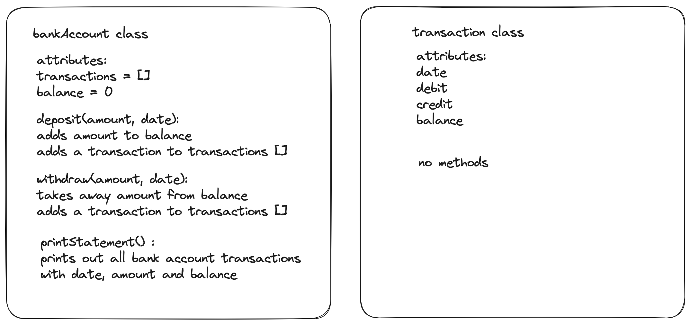

# Bank

- A bank account program made as part of the Makers Academy Software Development course

## The task

To be able to interact with the code via a REPL (Node)
To make deposits and withdrawals
To print an account statement with date, amount and balance

## Learning objectives

- Class design in JavaScript
- TDD with Jest

### Acceptance criteria

**Given** a client makes a deposit of 1000 on 10-01-2023  
**And** a deposit of 2000 on 13-01-2023  
**And** a withdrawal of 500 on 14-01-2023  
**When** she prints her bank statement  
**Then** she would see

```
date || credit || debit || balance
14/01/2023 || || 500.00 || 2500.00
13/01/2023 || 2000.00 || || 3000.00
10/01/2023 || 1000.00 || || 1000.00
```

## Setup

```zsh
# Install packages
npm install

# To get details on test coverage:
jest
```

## Built with

#### Languages used:

- JavaScript

#### Testing environment:

- Jest
  - Testing tool for JavaScript, created for Test Driven Development

## Design documents

Class design plan


## Example

```javaScript
// node
const BankAccount = require('./bankAccount');

let account = new BankAccount();
account.deposit(1000, "10/01/2023");
account.deposit(2000, "13/01/2023");
account.withdraw(500, "14/01/2023");
account.statement(); // returns
// date || credit || debit || balance
// 14/01/2023 ||  || 500.00 || 2500.00
// 13/01/2023 || 2000.00 ||  || 3000.00
// 10/01/2023 || 1000.00 ||  || 1000.00
```

## Future developments

-
