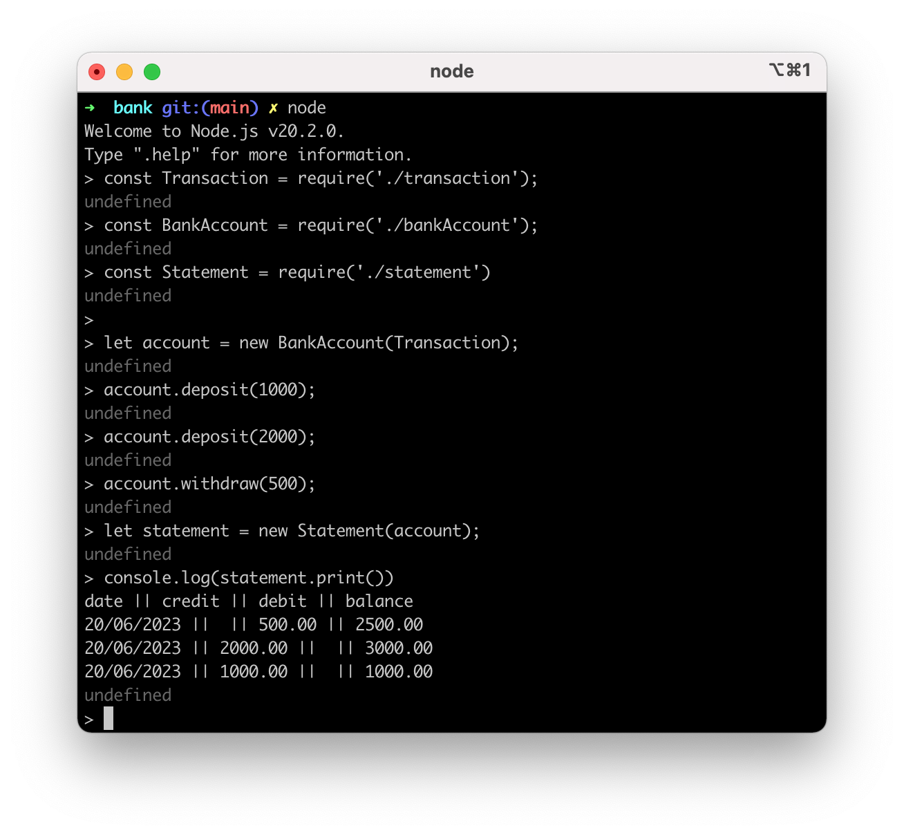

# Bank

- A bank account program made as part of the Makers Academy Software Development course

## The task

To make deposits and withdrawals
To print an account statement with date, amount and balance

## Learning objectives

- Class design in JavaScript
- TDD with Jest

### Acceptance criteria

**Given** a client makes a deposit of 1000 on 10-01-2023  
**And** a deposit of 2000 on 13-01-2023  
**And** a withdrawal of 500 on 14-01-2023  
**When** she prints her bank statement  
**Then** she would see

```
date || credit || debit || balance
14/01/2023 || || 500.00 || 2500.00
13/01/2023 || 2000.00 || || 3000.00
10/01/2023 || 1000.00 || || 1000.00
```

## Design

A three class design has been chosen:
A Transaction class holds the attributes of a single transaction (date, debit amount, credit amount and balance after transaction) and has one method setDate() to set the current date based on the js Date object.
A BankAccount class holds the current balance, an array of transactions and performs the following functions: 'deposit', and 'withdraw'.
A Statement class takes a single bankAccount object as an argument and prints all the transactions held within bankAccount as a statement.

Class design plan:


## Setup

```zsh
nvm use node
# Install packages
npm install

# To get details tests and test coverage:
jest
jest --coverage
```

## Built with

#### Languages used:

- JavaScript

#### Testing environment:

- Jest
  - Testing tool for JavaScript, created for Test Driven Development

## Example

```javaScript
// node
const Transaction = require('./transaction');
const BankAccount = require('./bankAccount');
const Statement = require('./statement')

let account = new BankAccount(Transaction);
account.deposit(1000);
account.deposit(2000);
account.withdraw(500);
let statement = new Statement(account);
statement.print(); // returns
// date || credit || debit || balance
// 20/06/2023 ||  || 500.00 || 2500.00
// 20/06/2023 || 2000.00 ||  || 3000.00
// 20/06/2023 || 1000.00 ||  || 1000.00
```


